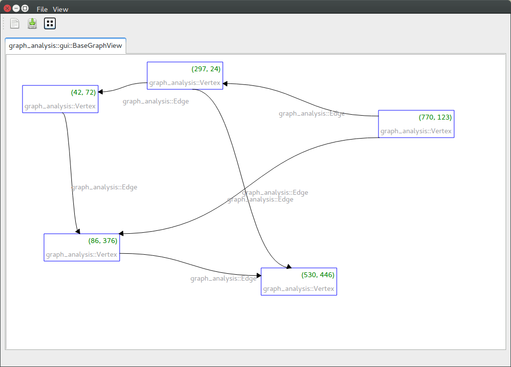

# Graph Analysis
[](https:///travis-ci.org/rock-core/tools-graph_analysis)


This library provides functionality for analyzing graphs and networks.
Its core functionality will come from other graph libraries such as [boost
graph](http://www.boost.org/doc/libs/1_55_0/libs/graph/doc/index.html),
[SNAP](http://snap.stanford.edu/snap/),
[LEMON](http://lemon.cs.elte.hu/trac/lemon).
Further graph libraries are available, but have not been integrated
[igraph](http://igraph.sourceforge.net), [graph-tool](http://graph-tool.skewed.de/),
[ogdf](http://ogdf.net/doku.php).

## Motivation
A number of different graph libraries exists - as listed above - though they cannot always be compared in a one to one fashion.
This library tries to provide a standard interface while maintaining access to
the particular features of each library.
The initial intention of implementing this graph library front-end was to benefit
from complementary graph algorithm implementations and add complementary
functionality.
Here, multi-commodity min-cost flow optimisation algorithms as well as, graph
filtering and percolation.
The goal of this library is to maintain a consistent and capable high-level
interface abstraction to facilitate graph modelling and analysis.

In addition, the graph analysis library comes with a small framework to design
graph-based UI in QT (see below).

## Examples

### Standard API Usage

```
#include "GraphAnalysis.hpp"
#include "lemon/Graph.hpp"
...
using namespace graph_analysis;

class MyVertex : Vertex
{
public:
    MyVertex(const std::string& attr)
        : mAttribute(attr)
    {}

    std::string getClassName() const { return "MyVertex"; }
    std::string toString() const { return getClassName() + " " + mAttribute; }
protected:
    /// To allow for cloning of graphs using deep copy
    Vertex* getClone() const { return new MyVertex(*this); }
private:
    std::string mAttribute;
};

BaseGraph::Ptr graph = BaseGraph::getInstance(BaseGraph::LEMON_DIRECTED_GRAPH);
Vertex::Ptr v0 = make_shared<MyVertex>();
Vertex::Ptr v1 = make_shared<MyVertex>();

Edge::Ptr e0 = make_shared<Edge>();
e0->setSourceVertex(v0);
e0->setTargetVertex(v1);

graph->add(e0);

int vertexCount = graph->getVertexCount();
int vertexCountInternal = ::lemon::countNodes(graph.raw());

VertexIterator::Ptr vertexIt = graph->getVertexIterator();
while(vertexIt->next())
{
   Vertex::Ptr vertex = vertexIt->current();
   printf("Vertex: %s\n", vertex->toString().c_str());
}

EdgeIterator::Ptr edgeIt = graph->getEdgeIterator();
while(edgeIt->next())
{
   Edge::Ptr edge = edgeIt->current();
   printf("Edge: %s\n", edge->toString().c_str());
}
```

### Graph I/O

Please refer to the detailed description of graph_analysis::io::GraphIO which is part of the doxygen
documentation.

### Graph GUI

This library provides a UI that permits developing other Qt-based interfaces that are based on graphs.
This UI intends to provide a mini-framework and basis for other projects to build on, by
reusing the GraphWidget class.

The UI supports:

 - import/export from/to gexf
 - save as pdf or svg
 - layouting of the graph using graphviz layout engine

After installation you can start the UI by calling:

```
    graph_analysis-gui
```

<p align="left">
  
</p>


## Installation from GitHub

Create a new Rock-based installation in a development folder, here called dev:
```
    mkdir dev
    cd dev
    wget http://www.rock-robotics.org/master/autoproj_bootstrap
    ruby autoproj_bootstrap
```

In autoproj/manifest add the respective manifest and add the package to the
layout section:
```
    package_set:
        - github: rock-core/rock-package_set

    layout:
        - tools/graph_analysis
```

```
$>source env.sh
$>autoproj update
$>autoproj osdeps
$>amake tools/graph_analysis
```

## Generate the documentation

To see the documentation of this project please do the following after
checkout to generate the doxygen-base documentation:

```
    mkdir build
    cd build
    make doc
```

Open the doxygen documentation with a browser: build/doc/index.html
The doxygen documentation contains all information on how to start
using the library along with the general API documentation.

## Testing

Running test in Rock is control via the Flag ROCK_TEST_ENABLED.
So activate the tests let autoproj set this cmake build flag:
```
$> autoproj test enable tools/graph_analysis
$> amake tools/graph_analysis
```

Then you can run the tests, which are implemented with Boost Testing Framework with:
```
$> ./build/test/test_graph --log_level=all
```

## Merge Request and Issue Tracking

GitHub is used for pull request and issue tracking: https://github.com/rock-core/tools-graph_analysis/issues

## License

This software is licensed under the LGPL-2.1 or newer.

GLPK for solving linear problems can be optionally embedded using the build flag
WITH_GLPK.
Activation and embedding GLPK via the CMake build flag WITH_GLPK will change the
license of the resulting work / binaries to GPL 3.0 (see COPYING file).

When you have [SCIP](https://scip.zib.de) installed, you can activate the use of [SCIP](https://scip.zib.de) with the buildflag WITH_SCIP.
Make sure you comply to SCIP's license requirements for non-commercial and commercial use.

Be aware however that functionality of the library can be optionally activated, since it requires GLPK.
Hence, activation and embeding GLPK via the CMake build flag WITH_GLPK will change the license or the resulting work / binaries to GPL.

## Copyright

Copyright (c) 2013-2018 Thomas M. Roehr and contributors, DFKI GmbH Robotics Innovation Center
